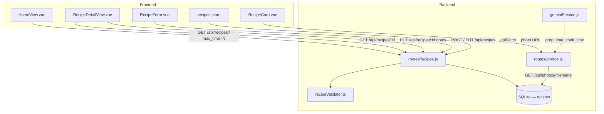

# Design Document — Recipe Enhancements

## Overview

This document describes the technical design for four incremental improvements
to the Recettes application: adjustable servings, prep/cook time fields,
photo display, and personal notes. All four share a single database migration
and are implemented as additive changes — no existing tables, routes, or
components are removed or structurally altered.

The design follows the existing conventions established in the MVP:
- Backend: Express routes + better-sqlite3 prepared statements + validator
  modules + a `sanitize` utility for XSS prevention.
- Frontend: Vue 3 `<script setup>` SFCs, Pinia stores, the existing `apiFetch`
  helper, CSS custom properties from the global theme.

---

## Architecture



### Change scope summary

| Layer | Files modified | New files |
|---|---|---|
| Database | — | `002_enhancements.sql` |
| Backend | `database.js`, `recipeValidator.js`, `routes/recipes.js`, `routes/photos.js`, `geminiService.js` | — |
| Frontend | `RecipeForm.vue`, `RecipeCard.vue`, `RecipeDetailView.vue`, `HomeView.vue`, `stores/recipes.js` | — |

---

## Components and Interfaces

### 1. Database Migration — `002_enhancements.sql`

A new SQL file placed in `backend/src/db/migrations/`. The migration runner
in `database.js` is updated to execute both files in order.

**Idempotency strategy**: SQLite does not support `ALTER TABLE … ADD COLUMN IF
NOT EXISTS`. The migration runner wraps each `ALTER TABLE` statement in an
individual try/catch; a `SQLITE_ERROR` with the message "duplicate column name"
is silently ignored, all other errors are re-thrown. This makes re-running the
migration safe.

```sql
-- Migration 002: add servings, prep_time, cook_time, notes to recipes
-- Each ALTER TABLE is idempotent: "duplicate column name" errors are caught
-- by the migration runner and silently ignored.

ALTER TABLE recipes ADD COLUMN servings  INTEGER NOT NULL DEFAULT 4;
ALTER TABLE recipes ADD COLUMN prep_time INTEGER;
ALTER TABLE recipes ADD COLUMN cook_time INTEGER;
ALTER TABLE recipes ADD COLUMN notes     TEXT;
```

### 2. Migration runner — `database.js`

The existing runner reads migration files from the `migrations/` directory.
It already runs `001_initial.sql`; it must now also run `002_enhancements.sql`.

**Design decision**: rather than a hard-coded list, the runner is updated to
read all `*.sql` files from the directory in lexicographic order. This means
future migrations (003, 004…) are picked up automatically without touching
`database.js` again. Each file's statements are split on `;` and executed
individually inside a try/catch so that `ALTER TABLE … ADD COLUMN` on an
already-migrated schema does not abort the entire startup.

### 3. Validator — `recipeValidator.js`

Four new optional fields are added to both `validateCreateRecipe` and
`validateUpdateRecipe`:

| Field | Type | Rules |
|---|---|---|
| `servings` | integer | optional; in [1, 100]; default 4 (creation only) |
| `prep_time` | integer | optional; ≥ 1 if present |
| `cook_time` | integer | optional; ≥ 1 if present |
| `notes` | string | optional; ≤ 2 000 characters |

The existing structure is preserved: a `validateField` helper returns a string
error message or `null`, and the result is collected in an `errors` object.

### 4. Routes — `routes/recipes.js`

**`GET /api/recipes` (list)**:
- The `SELECT` in `dataSql` is extended to include `photo_path`, `servings`,
  `prep_time`, `cook_time`.
- A new optional `max_time` query parameter is supported:
  - Validated as a positive integer (HTTP 400 otherwise).
  - Translated into a SQL condition:
    ```sql
    (
      (prep_time IS NOT NULL OR cook_time IS NOT NULL)
      AND COALESCE(prep_time, 0) + COALESCE(cook_time, 0) <= ?
    ) OR (prep_time IS NULL AND cook_time IS NULL)
    ```
  - Recipes where both time fields are NULL are always included (Req. 5.3).

**`GET /api/recipes/:id`** (via `getRecipeById`):
- The inner `SELECT` is extended to include `servings`, `prep_time`,
  `cook_time`, `notes`, `photo_path`.

**`POST /api/recipes`**:
- After validation, `servings`, `prep_time`, `cook_time`, `notes` are read
  from `req.body` and passed to the INSERT statement.
- `notes` is sanitised through the existing `sanitizeText` function.
- `servings` defaults to `4` if absent (matches DB default, but explicit for
  clarity).

**`PUT /api/recipes/:id`**:
- Same additions as POST. `servings` uses the submitted value or falls back
  to the current DB value if absent (read before the transaction; Req. 1.7).
- The `notes` field is sanitised before storage (Req. 9.5).

### 5. Photo endpoint — `routes/photos.js`

A new `GET /api/photos/:filename` route is added **in the same file** as the
existing `POST /api/photos`, so the auth middleware and the `uploadsDir`
constant are shared.

**Security checks** (in order):

1. **Path traversal**: `filename` must not contain `/`, `\`, or `..`. If it
   does → HTTP 400.
2. **Extension allowlist**: only `.jpg`, `.jpeg`, `.png` → otherwise HTTP 400.
3. **File existence**: use `fs.existsSync(fullPath)` → HTTP 404 if absent.
4. **Serve**: `res.sendFile(fullPath)` with an explicit `Content-Type` header
   (`image/jpeg` or `image/png`).

```javascript
// Pseudocode of the route handler
router.get('/:filename', auth, (req, res) => {
  const { filename } = req.params;

  // 1. Path traversal guard
  if (/[/\\]|\.\./.test(filename)) {
    return res.status(400).json({ error: 'Nom de fichier invalide.' });
  }

  // 2. Extension allowlist
  const ext = path.extname(filename).toLowerCase();
  if (!['.jpg', '.jpeg', '.png'].includes(ext)) {
    return res.status(400).json({ error: 'Extension non autorisée.' });
  }

  const fullPath = path.join(uploadsDir, filename);

  // 3. File existence
  if (!fs.existsSync(fullPath)) {
    return res.status(404).json({ error: 'Photo introuvable.' });
  }

  // 4. Serve with correct Content-Type
  const contentType = ext === '.png' ? 'image/png' : 'image/jpeg';
  res.setHeader('Content-Type', contentType);
  res.sendFile(fullPath);
});
```

### 6. Gemini service — `geminiService.js`

The prompt is updated to instruct Gemini to also extract `prep_time` and
`cook_time` as integers in minutes. The expected JSON structure becomes:

```json
{
  "name": "string",
  "ingredients": [ { "name": "string", "quantity": "string|null", "unit": "string|null" } ],
  "instructions": "string",
  "prep_time": 20,
  "cook_time": 45
}
```

Conversion rule stated in the prompt: "If a time is expressed in hours and
minutes (e.g. '1 h 30 min'), convert it to total minutes (90)."

The `structureRecipeFromOcr` return value is extended with `prep_time` (integer
or `null`) and `cook_time` (integer or `null`). The caller in `photos.js`
already passes the full `structured` object to the response; no caller change
is required except storing the new fields in the DB INSERT.

### 7. Frontend — `RecipeForm.vue`

Three new optional fields are appended after the "Instructions" textarea,
before the submit button:

- **Portions** (`servings`): `<input type="number" min="1" max="100">`.
  Pre-filled with `initialData.servings` (defaults to `4`).
- **Temps de préparation** (`prep_time`): `<input type="number" min="1">`,
  placeholder "minutes".
- **Temps de cuisson** (`cook_time`): `<input type="number" min="1">`,
  placeholder "minutes".

The `form` reactive object gains `servings`, `prep_time`, `cook_time`.
`initFromData` is extended to populate these fields.
The `body` assembled in `handleSubmit` includes them (as integers or
`undefined` when empty).

### 8. Frontend — `RecipeCard.vue`

Two additions:

**Time badge**: Displayed when `prep_time` or `cook_time` is non-null.
A `totalTime` computed property sums the two values (treating null as 0).
A `formattedTime` computed formats it as "X min" (< 60) or "Xh Ymin" (≥ 60).

**Thumbnail**: When `recipe.photo_path` is non-null, an `` is rendered
above the card body. The `src` is constructed from `import.meta.env.VITE_API_URL`
+ `/api/photos/` + the filename extracted from `photo_path`. An `@error`
handler hides the element on failure (sets a local `photoError` ref to true).

The `recipe` prop type gains `photo_path`, `prep_time`, `cook_time`.

### 9. Frontend — `RecipeDetailView.vue`

Four additions:

**Header photo**: When `recipe.photo_path` is non-null, a full-width ``
is rendered at the top of `.detail-header`. An `@error` handler hides it.

**Time info**: When at least one time field is non-null, a row in the header
shows "Préparation : X min — Cuisson : Y min — Total : Z min". Hidden when
both are null.

**Servings control**: Below the header, a stepper (`−`, count display, `+`)
initialised from `recipe.servings`. A `currentServings` ref and a
`servingsRatio` computed (`currentServings / recipe.servings`) drive a
`scaledIngredients` computed that maps each ingredient through the ratio.
`Numeric_Quantity` values (parseable as positive floats) are multiplied and
rounded to 2 decimal places; others are left unchanged. The ingredient list
renders `scaledIngredients` instead of `recipe.ingredients` directly. This
change is purely in-memory (no API calls). Navigating away resets the state
because `currentServings` is a local `ref` initialised in `onMounted`.

**Inline notes editor**: A `<section>` labelled "Mes notes" is appended after
instructions. It has two modes controlled by an `editingNotes` ref:
- **Read mode**: shows `recipe.notes` text (or a placeholder if null/empty),
  with a pencil button to switch to edit mode.
- **Edit mode**: a `<textarea>` pre-filled with the current notes, a character
  counter (`N / 2000`), a "Sauvegarder" button (disabled while saving), and
  an "Annuler" button. Saving calls `recipesStore.updateRecipe(id, { ...recipe, notes })`;
  on success it switches back to read mode and updates `recipe.notes` locally;
  on error it stays in edit mode and shows an error message.

### 10. Frontend — `HomeView.vue`

A `<select>` time-filter dropdown is added to the `.search-section`, between
the `SearchBar` and the category filter. Options:

```
Toutes les durées   (value: null)
Moins de 30 min     (value: 30)
Moins de 1 h        (value: 60)
Moins de 2 h        (value: 120)
```

A `maxTime` ref (initially `null`) drives a `watch` that calls `loadRecipes()`
with `currentPage.value = 1` when changed (Req. 5.6).

### 11. Frontend — `stores/recipes.js`

`fetchRecipes` is updated to pass `max_time` when set:

```javascript
if (filters.maxTime) params.set('max_time', String(filters.maxTime));
```

---

## Data Models

### Database schema diff (after migration 002)

```sql
recipes (
  id           INTEGER PRIMARY KEY AUTOINCREMENT,
  name         TEXT    NOT NULL UNIQUE COLLATE NOCASE,
  instructions TEXT    NOT NULL DEFAULT '',
  ocr_text     TEXT,
  photo_path   TEXT,
  servings     INTEGER NOT NULL DEFAULT 4,   -- NEW
  prep_time    INTEGER,                       -- NEW (minutes, nullable)
  cook_time    INTEGER,                       -- NEW (minutes, nullable)
  notes        TEXT,                          -- NEW (nullable)
  created_at   TEXT    NOT NULL DEFAULT ...,
  updated_at   TEXT    NOT NULL DEFAULT ...
)
```

### API response — `GET /api/recipes` (list item)

```json
{
  "id": 1,
  "name": "Tarte aux pommes",
  "categories": [{ "id": 2, "name": "Dessert" }],
  "photo_path": "uploads/1700000000000_photo.jpg",
  "prep_time": 20,
  "cook_time": 45,
  "servings": 4,
  "updated_at": "2025-01-15T10:30:00.000Z"
}
```

### API response — `GET /api/recipes/:id` (detail)

```json
{
  "id": 1,
  "name": "Tarte aux pommes",
  "instructions": "...",
  "ocr_text": null,
  "photo_path": "uploads/1700000000000_photo.jpg",
  "servings": 4,
  "prep_time": 20,
  "cook_time": 45,
  "notes": "Ajouter de la cannelle.",
  "created_at": "2025-01-15T10:00:00.000Z",
  "updated_at": "2025-01-15T10:30:00.000Z",
  "ingredients": [ { "id": 1, "name": "Pomme", "quantity": "500", "unit": "g", "position": 0 } ],
  "categories": [ { "id": 2, "name": "Dessert" } ]
}
```

### Photo URL construction (frontend)

```
${import.meta.env.VITE_API_URL}/api/photos/${filename}
```

Where `filename` is extracted from `photo_path` using
`photo_path.split('/').pop()`.

### Gemini structured output (extended)

```json
{
  "name": "string",
  "ingredients": [ { "name": "string", "quantity": "string|null", "unit": "string|null" } ],
  "instructions": "string",
  "prep_time": 20,
  "cook_time": 45
}
```

---

## Correctness Properties

*A property is a characteristic or behavior that should hold true across all
valid executions of a system — essentially, a formal statement about what the
system should do. Properties serve as the bridge between human-readable
specifications and machine-verifiable correctness guarantees.*

The project already uses **fast-check** for property-based testing (280 existing
backend tests). New properties below are additions to that suite.

### Property 1: Servings ratio scales numeric quantities correctly

*For any* recipe ingredient with a numeric quantity Q, an original servings
count S (1 ≤ S ≤ 100), and a target servings count T (1 ≤ T ≤ 100), the
displayed quantity after scaling equals `round(Q × T / S, 2)`.

**Validates: Requirements 2.6, 2.7**

### Property 2: Non-numeric quantities are unaffected by servings scaling

*For any* ingredient whose quantity value cannot be parsed as a positive decimal
number, changing the servings count SHALL leave the displayed quantity
identical to the original value.

**Validates: Requirements 2.8**

### Property 3: Servings control stays within bounds [1, 100]

*For any* sequence of `+` and `−` button activations starting from any
initial servings value in [1, 100], the resulting displayed servings count
SHALL always remain in the range [1, 100].

**Validates: Requirements 2.2, 2.3, 2.4, 2.5**

### Property 4: max_time filter — timeless recipes are always returned

*For any* `max_time` threshold and any recipe whose both `prep_time` and
`cook_time` are NULL, the recipe SHALL appear in the response of
`GET /api/recipes?max_time=<threshold>`.

**Validates: Requirements 5.3**

### Property 5: max_time filter — timed recipes respect the threshold

*For any* `max_time` threshold T and any recipe whose
`COALESCE(prep_time,0) + COALESCE(cook_time,0) > T`, the recipe SHALL NOT
appear in the filtered response.

**Validates: Requirements 5.2, 5.3**

---

## Error Handling

### Backend

| Situation | HTTP status | Body |
|---|---|---|
| `servings` outside [1, 100] | 400 | `{ error: "Données invalides", details: { servings: "..." } }` |
| `prep_time` or `cook_time` < 1 | 400 | `{ error: "Données invalides", details: { prep_time/cook_time: "..." } }` |
| `notes` > 2000 characters | 400 | `{ error: "Données invalides", details: { notes: "..." } }` |
| `max_time` not a positive integer | 400 | `{ error: "Paramètres de recherche invalides", details: { max_time: "..." } }` |
| `GET /api/photos/:filename` — path traversal | 400 | `{ error: "Nom de fichier invalide." }` |
| `GET /api/photos/:filename` — bad extension | 400 | `{ error: "Extension non autorisée." }` |
| `GET /api/photos/:filename` — file not found | 404 | `{ error: "Photo introuvable." }` |

All existing error-handling conventions are preserved: validation errors are
collected into a `details` object keyed by field name so the frontend can
display inline messages.

### Frontend

| Situation | Behaviour |
|---|---|
| Photo fails to load (Detail_View) | `@error` handler sets `photoLoadError = true`; `v-if="!photoLoadError"` hides the `` |
| Photo fails to load (RecipeCard) | Same pattern with a local `thumbnailError` ref |
| Notes save fails | Stay in edit mode; show inline error message; re-enable save button |
| Notes save in progress | Save button disabled (`saving` ref) |

---

## Testing Strategy

### Existing test suite

The project has 280 backend tests using **Vitest** + **fast-check**. All new
code must integrate into the same setup. No new test framework is introduced.

### Unit tests (example-based)

New unit tests cover:
- `validateCreateRecipe` / `validateUpdateRecipe` with new fields: valid
  values, out-of-range values, missing fields, boundary values (servings = 1,
  100; prep_time = 1; notes = 2000 chars; notes = 2001 chars).
- `GET /api/photos/:filename`: path traversal attempts (`../secret`,
  `foo/bar.jpg`), bad extensions (`.gif`, `.exe`), missing file, valid file.
- `GET /api/recipes?max_time=`: non-integer value, negative value, zero, valid
  threshold that filters some recipes and returns timeless ones.
- `structureRecipeFromOcr`: verify that `prep_time` and `cook_time` are
  present in the returned object and are integers or null.

### Property-based tests (fast-check)

Four properties are implemented as fast-check tests in the backend test suite,
plus one property for the pure scaling logic (which can be tested in isolation
without Vue):

**Property 1 — Servings scaling (pure function test)**
```
// Feature: recipe-enhancements, Property 1: servings ratio scales numeric quantities
fc.assert(fc.property(
  fc.float({ min: 0.01, max: 9999, noNaN: true }),  // Q: numeric quantity
  fc.integer({ min: 1, max: 100 }),                  // S: original servings
  fc.integer({ min: 1, max: 100 }),                  // T: target servings
  (Q, S, T) => {
    const result = scaleQuantity(String(Q), S, T);
    const expected = Math.round((Q * T / S) * 100) / 100;
    return Math.abs(parseFloat(result) - expected) < 0.001;
  }
))
```

**Property 2 — Non-numeric quantities unchanged**
```
// Feature: recipe-enhancements, Property 2: non-numeric quantities unaffected
fc.assert(fc.property(
  fc.string().filter(s => isNaN(parseFloat(s)) || parseFloat(s) <= 0),
  fc.integer({ min: 1, max: 100 }),
  fc.integer({ min: 1, max: 100 }),
  (qty, S, T) => scaleQuantity(qty, S, T) === qty
))
```

**Property 3 — Servings control bounds** (tested as a pure stepper logic function)

**Property 4 & 5 — max_time filter** (integration-style: insert test recipes,
call the route with various thresholds, verify the returned set)

### Integration tests

- `POST /api/recipes` and `PUT /api/recipes/:id` with the four new fields
  (happy path and error paths).
- `GET /api/recipes` with `max_time` parameter (with a seeded test DB
  containing recipes with various time combinations).
- `GET /api/photos/:filename` (with a small test image file copied to a temp
  uploads dir).
