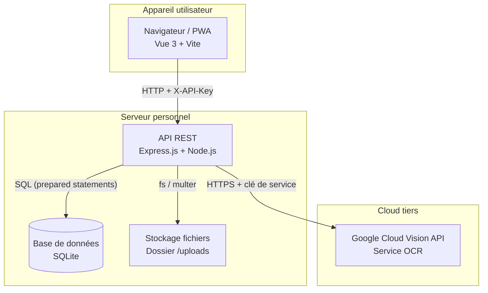
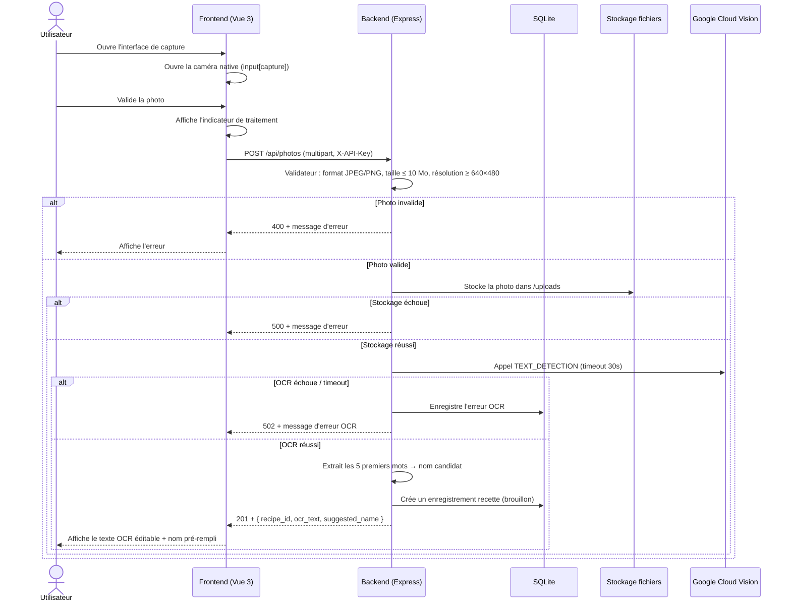
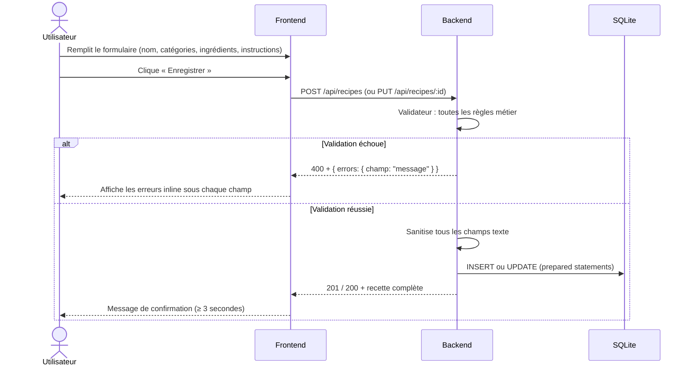
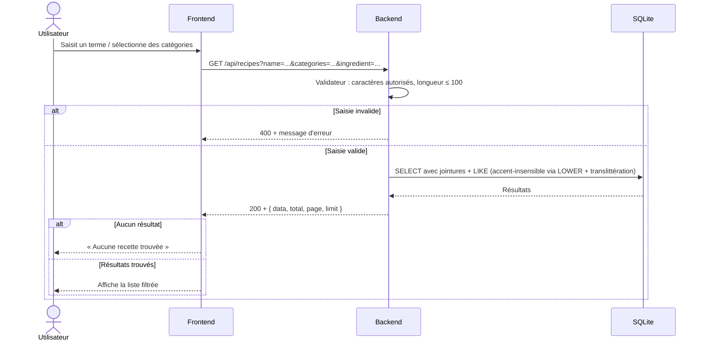

# Technical Design

## Overview

### Objectif

L'application est un système personnel de gestion de recettes de cuisine,
accessible via un navigateur web et installable en tant que PWA (Progressive
Web App). Elle permet de capturer des recettes papier par photo, d'en extraire
le texte via un service OCR cloud, puis de créer, éditer, catégoriser,
rechercher et supprimer des recettes. L'usage est strictement personnel
(un seul utilisateur, pas de comptes multiples).

### Architecture générale

L'application est organisée en deux couches principales : un **frontend**
(application Vue 3) et un **backend** (API REST Express.js). Les deux partagent
le même dépôt Git (monorepo) mais sont déployables indépendamment.



Le backend est le **seul** composant à communiquer avec le service OCR cloud.
Le frontend ne connaît pas la clé du service OCR — il envoie uniquement la
photo au backend via l'API REST protégée par la clé API partagée.

---

## Choix de stack technique

### Frontend

| Technologie | Version minimale | Justification |
|---|---|---|
| **Vue 3** | 3.4 | Framework progressif, syntaxe Composition API lisible pour un dev junior, grande communauté, tutoriels en français disponibles |
| **Vite** | 5.x | Bundler ultra-rapide, configuration simple, intègre nativement vite-plugin-pwa |
| **vite-plugin-pwa** | 0.20 | Génère le service worker (Workbox) et le manifest PWA avec une configuration déclarative minimale |
| **Vue Router** | 4.x | Navigation SPA officielle Vue, simple à apprendre |
| **Pinia** | 2.x | Store d'état officiel Vue 3, plus simple que Vuex pour un junior |

**Pas de framework CSS lourd** : on utilise du CSS natif avec des variables CSS
pour la thématisation. Cela réduit la dépendance à des outils externes et
favorise l'apprentissage du CSS de base.

### Backend

| Technologie | Version minimale | Justification |
|---|---|---|
| **Node.js** | 20 LTS | Même langage côté client et serveur (JavaScript), courbe d'apprentissage réduite |
| **Express.js** | 4.x | Framework web minimaliste, bien documenté, idéal pour débuter |
| **better-sqlite3** | 9.x | Client SQLite synchrone, API simple, pas de callback hell, parfait pour un projet single-user |
| **Multer** | 1.x | Middleware Node.js standard pour l'upload de fichiers multipart/form-data |
| **@google-cloud/vision** | 4.x | SDK officiel Google Cloud Vision pour Node.js |
| **dotenv** | 16.x | Chargement des variables d'environnement depuis `.env` |
| **helmet** | 7.x | En-têtes de sécurité HTTP en une ligne |
| **express-rate-limit** | 7.x | Limitation du débit des requêtes pour réduire les abus |
| **sharp** | 0.33 | Validation et lecture des métadonnées des images (dimensions, format) |

### Base de données

**SQLite** via `better-sqlite3`. Ce choix est justifié par :
- Usage single-user : aucun besoin de connexions concurrentes
- Zéro configuration serveur (fichier local)
- Sauvegardes triviales (copie d'un fichier)
- Migration vers PostgreSQL possible à l'avenir si nécessaire (les requêtes SQL
  sont standard)

### Service OCR

**Google Cloud Vision API** (`TEXT_DETECTION`) :
- API REST HTTPS standard, SDK Node.js officiel
- Excellente reconnaissance pour du texte imprimé de cuisine
- Modèle de tarification à l'usage (gratuit jusqu'à 1 000 requêtes/mois)
- La clé de service Google (`credentials.json`) est **exclue du dépôt** et
  référencée uniquement via la variable d'environnement
  `GOOGLE_APPLICATION_CREDENTIALS`

### Tests

| Technologie | Version minimale | Justification |
|---|---|---|
| **Vitest** | 1.x | Compatible Vite, API identique à Jest, zéro configuration |
| **supertest** | 6.x | Requêtes HTTP simulées sur le serveur Express (tests d'intégration) |
| **fast-check** | 3.x | Bibliothèque de property-based testing pour JavaScript/TypeScript |

---

## Structure du projet

```
recettes/
├── .env.example                   # Modèle des variables d'environnement (commité)
├── .gitignore
├── README.md
│
├── frontend/                      # Application Vue 3
│   ├── public/
│   │   └── icons/                 # Icônes PWA (192px, 512px)
│   ├── src/
│   │   ├── assets/                # CSS global, images statiques
│   │   ├── components/            # Composants Vue réutilisables
│   │   │   ├── RecipeCard.vue
│   │   │   ├── RecipeForm.vue
│   │   │   ├── CategorySelector.vue
│   │   │   ├── SearchBar.vue
│   │   │   └── LoadingSpinner.vue
│   │   ├── views/                 # Pages routées
│   │   │   ├── HomeView.vue       # Liste + recherche
│   │   │   ├── RecipeDetailView.vue
│   │   │   ├── RecipeEditView.vue
│   │   │   └── PhotoCaptureView.vue
│   │   ├── stores/                # Stores Pinia
│   │   │   ├── recipes.js
│   │   │   └── categories.js
│   │   ├── services/              # Appels API (fetch)
│   │   │   └── api.js
│   │   ├── router/
│   │   │   └── index.js
│   │   └── main.js
│   ├── vite.config.js
│   └── package.json
│
├── backend/                       # API REST Express
│   ├── src/
│   │   ├── app.js                 # Configuration Express (middleware globaux)
│   │   ├── server.js              # Point d'entrée (listen)
│   │   ├── db/
│   │   │   ├── database.js        # Connexion SQLite + initialisation
│   │   │   └── migrations/
│   │   │       └── 001_initial.sql
│   │   ├── routes/
│   │   │   ├── recipes.js         # /api/recipes
│   │   │   ├── categories.js      # /api/categories
│   │   │   └── photos.js          # /api/photos
│   │   ├── middleware/
│   │   │   ├── auth.js            # Vérification X-API-Key
│   │   │   └── errorHandler.js    # Gestionnaire d'erreurs global
│   │   ├── validators/
│   │   │   ├── recipeValidator.js
│   │   │   ├── categoryValidator.js
│   │   │   └── photoValidator.js
│   │   ├── services/
│   │   │   └── ocrService.js      # Appel Google Cloud Vision
│   │   └── utils/
│   │       └── sanitize.js        # Sanitisation des entrées texte
│   ├── uploads/                   # Photos stockées (exclu du dépôt)
│   ├── data/
│   │   └── recettes.db            # Fichier SQLite (exclu du dépôt)
│   ├── tests/
│   │   ├── unit/
│   │   │   ├── validators.test.js
│   │   │   ├── sanitize.test.js
│   │   │   ├── ocrNameExtractor.test.js
│   │   │   └── properties/
│   │   │       └── validators.property.test.js
│   │   └── integration/
│   │       ├── recipes.test.js
│   │       ├── categories.test.js
│   │       └── photos.test.js
│   └── package.json
```

---

## Data Models

### Schéma de la base de données SQLite

```sql
-- Migration 001_initial.sql

-- Table des catégories
CREATE TABLE IF NOT EXISTS categories (
    id        INTEGER PRIMARY KEY AUTOINCREMENT,
    name      TEXT    NOT NULL UNIQUE COLLATE NOCASE,
    -- Timestamp de création (ISO 8601)
    created_at TEXT   NOT NULL DEFAULT (strftime('%Y-%m-%dT%H:%M:%fZ', 'now'))
);

-- Catégories par défaut insérées à la première migration
INSERT OR IGNORE INTO categories (name) VALUES
    ('Entrée'),
    ('Plat principal'),
    ('Dessert'),
    ('Soupe'),
    ('Salade'),
    ('Sauce'),
    ('Boisson'),
    ('Autre');

-- Table principale des recettes
CREATE TABLE IF NOT EXISTS recipes (
    id            INTEGER PRIMARY KEY AUTOINCREMENT,
    name          TEXT    NOT NULL UNIQUE COLLATE NOCASE,
    instructions  TEXT    NOT NULL DEFAULT '',
    ocr_text      TEXT,               -- Texte brut extrait par l'OCR (archivé)
    photo_path    TEXT,               -- Chemin relatif dans /uploads
    created_at    TEXT    NOT NULL DEFAULT (strftime('%Y-%m-%dT%H:%M:%fZ', 'now')),
    updated_at    TEXT    NOT NULL DEFAULT (strftime('%Y-%m-%dT%H:%M:%fZ', 'now'))
);

-- Table des ingrédients (relation 1 recette → N ingrédients)
CREATE TABLE IF NOT EXISTS ingredients (
    id         INTEGER PRIMARY KEY AUTOINCREMENT,
    recipe_id  INTEGER NOT NULL REFERENCES recipes(id) ON DELETE CASCADE,
    name       TEXT    NOT NULL,
    quantity   TEXT,   -- Valeur libre (ex. "2", "1/2", "une pincée")
    unit       TEXT,   -- Unité libre (ex. "kg", "c. à soupe", "")
    position   INTEGER NOT NULL DEFAULT 0  -- Ordre d'affichage
);

-- Table de liaison recette ↔ catégorie (relation N-N)
CREATE TABLE IF NOT EXISTS recipe_categories (
    recipe_id   INTEGER NOT NULL REFERENCES recipes(id) ON DELETE CASCADE,
    category_id INTEGER NOT NULL REFERENCES categories(id) ON DELETE CASCADE,
    PRIMARY KEY (recipe_id, category_id)
);

-- Index pour accélérer la recherche plein texte sur le nom
CREATE INDEX IF NOT EXISTS idx_recipes_name ON recipes(name COLLATE NOCASE);
-- Index pour la recherche par ingrédient
CREATE INDEX IF NOT EXISTS idx_ingredients_name ON ingredients(name COLLATE NOCASE);
```

### Entités applicatives (représentation JSON côté API)

#### Recette complète (réponse GET /api/recipes/:id)

```json
{
  "id": 1,
  "name": "Tarte aux pommes",
  "instructions": "1. Préchauffer le four à 180°C.\n2. Éplucher les pommes...",
  "categories": [
    { "id": 3, "name": "Dessert" }
  ],
  "ingredients": [
    { "id": 1, "name": "Pomme", "quantity": "4", "unit": "pièces", "position": 0 },
    { "id": 2, "name": "Sucre", "quantity": "100", "unit": "g", "position": 1 }
  ],
  "photo_path": "/uploads/1234567890_photo.jpg",
  "ocr_text": "Tarte aux pommes\nIngrédients : ...",
  "created_at": "2024-01-15T10:30:00.000Z",
  "updated_at": "2024-01-15T10:30:00.000Z"
}
```

#### Recette résumée (élément de liste GET /api/recipes)

```json
{
  "id": 1,
  "name": "Tarte aux pommes",
  "categories": [{ "id": 3, "name": "Dessert" }],
  "updated_at": "2024-01-15T10:30:00.000Z"
}
```

---

## Components and Interfaces

Toutes les routes sont préfixées par `/api`. Toutes les requêtes exigent
l'en-tête `X-API-Key` avec la valeur correspondant à la variable d'environnement
`API_KEY`.

### Authentification

```
X-API-Key: <valeur de la variable d'environnement API_KEY>
```

Si la clé est absente ou incorrecte → `HTTP 401` avec corps `{"error": "accès non autorisé"}`.

### Recettes

| Méthode | Chemin | Description |
|---|---|---|
| `GET` | `/api/recipes` | Liste paginée + filtres (name, category_id, ingredient) |
| `GET` | `/api/recipes/:id` | Détail d'une recette |
| `POST` | `/api/recipes` | Créer une recette |
| `PUT` | `/api/recipes/:id` | Mettre à jour une recette |
| `DELETE` | `/api/recipes/:id` | Supprimer une recette |

#### GET /api/recipes — paramètres de requête

| Paramètre | Type | Description |
|---|---|---|
| `name` | string (≤ 100 car.) | Recherche insensible à la casse et aux accents sur le nom |
| `ingredient` | string (≤ 100 car.) | Recherche insensible à la casse et aux accents sur le nom d'ingrédient |
| `categories` | string | IDs de catégories séparés par virgule (ex. `1,3`) — logique ET |
| `page` | integer ≥ 1 | Numéro de page (défaut : 1) |
| `limit` | integer 1–100 | Résultats par page (défaut : 20) |

Réponse :
```json
{
  "data": [ /* liste de recettes résumées */ ],
  "total": 42,
  "page": 1,
  "limit": 20
}
```

#### POST /api/recipes — corps de la requête

```json
{
  "name": "Tarte aux pommes",
  "instructions": "1. Préchauffer...",
  "category_ids": [3],
  "ingredients": [
    { "name": "Pomme", "quantity": "4", "unit": "pièces" },
    { "name": "Sucre", "quantity": "100", "unit": "g" }
  ]
}
```

#### PUT /api/recipes/:id — même format que POST

#### Codes de retour communs

| Code | Situation |
|---|---|
| `200` | Succès (GET, PUT) |
| `201` | Création réussie (POST) |
| `204` | Suppression réussie (DELETE) |
| `400` | Données invalides (validation) |
| `401` | Clé API absente ou invalide |
| `404` | Ressource introuvable |
| `409` | Conflit (nom de recette déjà existant) |
| `500` | Erreur serveur interne |

### Catégories

| Méthode | Chemin | Description |
|---|---|---|
| `GET` | `/api/categories` | Liste de toutes les catégories |
| `POST` | `/api/categories` | Créer une nouvelle catégorie |

#### POST /api/categories — corps de la requête

```json
{ "name": "Apéritif" }
```

### Photos et OCR

| Méthode | Chemin | Description |
|---|---|---|
| `POST` | `/api/photos` | Envoyer une photo, déclencher l'OCR |

#### POST /api/photos — multipart/form-data

Champ `photo` : fichier image JPEG ou PNG, taille ≤ 10 Mo, résolution ≥ 640×480 px.

Réponse (succès) :
```json
{
  "recipe_id": 7,
  "ocr_text": "Tarte Tatin\nIngrédients : ...",
  "suggested_name": "Tarte Tatin Ingrédients"
}
```

---

## Architecture

### Flux 1 : Capture photo → OCR → Recette



### Flux 2 : Création manuelle / édition de recette



### Flux 3 : Recherche de recettes



---

## Stratégie de sécurité

### Clé API (Requirement 10)

- Le middleware `auth.js` lit la variable d'environnement `API_KEY` au
  démarrage du serveur.
- Il compare l'en-tête `X-API-Key` de chaque requête avec la valeur stockée,
  **caractère par caractère** (comparaison timing-safe via `crypto.timingSafeEqual`
  pour éviter les attaques par canal auxiliaire).
- Si la clé est absente ou incorrecte : `HTTP 401`, corps `{"error": "accès non autorisé"}`,
  aucune donnée applicative incluse.
- Chaque tentative refusée est enregistrée dans les logs avec : date, heure,
  adresse IP source. La valeur de la clé soumise n'est **jamais** loguée.
- `API_KEY` doit comporter au moins 32 caractères ; le serveur refuse de
  démarrer si la variable est absente ou trop courte.

### Validation et sanitisation des entrées (Requirements 2, 3, 4, 5, 7, 11)

Tous les champs entrants passent par le module `validators/` puis `utils/sanitize.js`.

| Type de champ | Règles de validation | Sanitisation |
|---|---|---|
| Nom recette | Non vide, ≤ 200 car., unique (insensible casse) | `trim()`, suppression balises |
| Instructions | Non vides, ≤ 10 000 car. | `trim()`, suppression balises exécutables |
| Nom ingrédient | Non vide, ≤ 200 car. | `trim()` |
| Quantité / unité | ≤ 50 car. | `trim()` |
| Texte OCR | Non vide, ≤ 50 000 car., pas de séquences `{{`, `<%`, `<script` | `trim()` |
| Nom catégorie | Non vide, ≤ 100 car., unique (insensible casse + trim) | `trim()` |
| Terme de recherche | ≤ 100 car., pas de caractères de contrôle (U+0000–U+001F) | `trim()` |
| Fichier image | JPEG ou PNG, ≤ 10 Mo, résolution ≥ 640×480 px | — |

**Protection injection SQL** : toutes les requêtes SQLite utilisent des
*prepared statements* avec des placeholders `?` ; aucune concaténation de
données utilisateur dans les chaînes SQL.

**Protection injection de template** : le validateur du texte OCR et des champs
texte vérifie et rejette les séquences `{{`, `<%`, `<script`.

### Variables d'environnement et secrets

Fichier `.env` (exclu du dépôt via `.gitignore`) :

```ini
# Clé d'accès partagée entre le frontend et le backend
API_KEY=<chaîne aléatoire d'au moins 32 caractères>

# Chemin absolu vers le fichier de credentials Google Cloud
GOOGLE_APPLICATION_CREDENTIALS=/chemin/vers/credentials.json

# Port du serveur Express
PORT=3000

# Chemin du dossier de stockage des photos
UPLOADS_DIR=./uploads

# Chemin du fichier SQLite
DB_PATH=./data/recettes.db
```

Le fichier `.gitignore` exclut au minimum :
`.env`, `.env.local`, `.env.production`, `node_modules/`, `__pycache__/`,
`*.key`, `*.pem`, `secrets.*`, `backend/uploads/`, `backend/data/`.

---

## Stratégie PWA

### Manifeste Web App (`frontend/public/manifest.webmanifest`)

```json
{
  "name": "Mes Recettes",
  "short_name": "Recettes",
  "description": "Gestion personnelle de recettes de cuisine",
  "start_url": "/",
  "display": "standalone",
  "background_color": "#ffffff",
  "theme_color": "#2d6a4f",
  "orientation": "portrait-primary",
  "icons": [
    { "src": "/icons/icon-192.png", "sizes": "192x192", "type": "image/png", "purpose": "maskable any" },
    { "src": "/icons/icon-512.png", "sizes": "512x512", "type": "image/png", "purpose": "maskable any" }
  ]
}
```

### Service Worker (Workbox via vite-plugin-pwa)

Stratégie en deux niveaux :

1. **Precache** (ressources statiques de l'application) :
   - Tous les assets Vite (JS, CSS, HTML) sont précachés au moment du `install`
     du service worker.
   - Stratégie : **CacheFirst** pour ces assets.

2. **Runtime caching** (données dynamiques) :
   - Requêtes `GET /api/recipes/**` : stratégie **NetworkFirst** avec fallback
     cache (TTL 24 h). Permet la consultation hors connexion des recettes déjà
     chargées.
   - Requêtes `GET /api/categories` : stratégie **StaleWhileRevalidate** (TTL 7 j).
   - Upload photo et mutations (POST, PUT, DELETE) : **pas de cache** — ces
     requêtes échouent silencieusement en mode hors connexion avec un message
     explicite à l'utilisateur.

3. **Offline fallback** :
   - Si une recette n'est pas dans le cache et que le réseau est absent,
     le service worker renvoie une réponse spéciale `offline.json` que le
     frontend interprète pour afficher le message approprié.

### Wake Lock (Requirement 8)

Sur la vue détail d'une recette, le composant `RecipeDetailView.vue` tente
d'acquérir un `WakeLockSentinel` via `navigator.wakeLock.request('screen')`.
Si l'API est indisponible (`TypeError`) ou si la permission est refusée
(`NotAllowedError`), l'exception est interceptée silencieusement — la vue
s'affiche normalement. Le verrou est libéré au `beforeUnmount` du composant.

---

## Error Handling

### Frontend

- Toute requête API en erreur est interceptée dans `services/api.js` (wrapper
  autour de `fetch`).
- Les erreurs de validation (400) sont propagées sous forme d'un objet
  `{ errors: { champ: "message" } }` et affichées inline sous chaque champ
  du formulaire concerné.
- Les erreurs réseau ou serveur (5xx) déclenchent un message d'erreur global
  non intrusif (bannière en haut de page, disparaît après 5 s).
- Les opérations de durée > 500 ms affichent un indicateur de chargement
  (spinner ≥ 24×24 px) qui disparaît à la réception de la réponse.

### Backend

- Un middleware `errorHandler.js` centralisé intercepte toutes les erreurs
  non traitées.
- Les erreurs de validation retournent un JSON structuré :
  ```json
  { "error": "Données invalides", "details": { "name": "Le nom ne peut pas être vide" } }
  ```
- Les erreurs serveur internes (5xx) retournent un message générique sans
  fuite d'informations techniques.
- Le timeout OCR (30 s) est géré avec `Promise.race` : si `@google-cloud/vision`
  ne répond pas dans le délai imparti, l'erreur est loguée et une réponse 502
  est retournée au frontend.

---

## Correctness Properties

*Une propriété est une caractéristique ou un comportement qui doit être vrai
pour toutes les exécutions valides d'un système — essentiellement, un énoncé
formel de ce que le système doit faire. Les propriétés servent de pont entre
les spécifications lisibles par un humain et les garanties de correction
vérifiables automatiquement.*

### Property 1: La validation rejette les champs texte vides ou uniquement composés d'espaces

*Pour tout* texte soumis comme nom de recette, nom de catégorie ou instructions,
si ce texte est vide ou composé exclusivement de caractères d'espacement
(espaces, tabulations, sauts de ligne), le validateur doit rejeter la soumission
et renvoyer une erreur de validation.

**Validates: Requirements 2.3, 2.4, 3.5, 3.6, 4.5, 5.2**

### Property 2: La validation rejette les textes dépassant leur limite

*Pour tout* texte soumis à un champ dont la longueur maximale est définie
(nom de recette : 200 car., texte OCR : 50 000 car., instructions : 10 000 car.,
nom de catégorie : 100 car., terme de recherche : 100 car.), si la longueur du
texte dépasse cette limite, le validateur doit rejeter la soumission.

**Validates: Requirements 2.5, 3.5, 3.6, 4.5, 5.2, 7.1**

### Property 3: La validation rejette les textes contenant des séquences de balisage exécutable

*Pour tout* texte soumis dans le champ texte OCR ou dans les champs de recette,
si ce texte contient l'une des séquences `{{`, `<%` ou `<script`, le validateur
doit rejeter la soumission.

**Validates: Requirements 2.6**

### Property 4: L'extraction du nom candidat depuis le texte OCR produit au plus les 5 premiers mots tronqués à 200 caractères

*Pour tout* texte OCR contenant au moins un mot non vide, la fonction d'extraction
du nom candidat doit retourner une chaîne composée des 5 premiers mots non vides
(séparés par un espace) dont la longueur est au maximum 200 caractères. Pour tout
texte OCR vide ou ne contenant aucun mot, la fonction doit retourner une chaîne vide.

**Validates: Requirements 3.1, 3.2**

### Property 5: La recherche par nom retourne uniquement les recettes dont le nom contient le terme

*Pour tout* terme de recherche non vide `t` et tout ensemble de recettes en base
de données, toutes les recettes retournées par `GET /api/recipes?name=t` doivent
avoir un nom qui contient `t` (comparaison insensible à la casse).

**Validates: Requirements 7.2**

### Property 6: La recherche par catégorie retourne uniquement les recettes associées à toutes les catégories sélectionnées

*Pour tout* ensemble de catégories sélectionnées `C` (non vide), toutes les
recettes retournées par `GET /api/recipes?categories=...` doivent être associées
à **chacune** des catégories de `C`.

**Validates: Requirements 7.3**

### Property 7: La recherche par ingrédient retourne uniquement les recettes contenant un ingrédient dont le nom contient le terme

*Pour tout* terme de recherche `t` dans le champ ingrédient, toutes les recettes
retournées doivent posséder au moins un ingrédient dont le nom contient `t`
(comparaison insensible à la casse).

**Validates: Requirements 7.4**

### Property 8: La recherche combinée (nom + catégories) respecte la logique ET

*Pour tout* terme de nom `t` et tout ensemble de catégories `C` fournis
simultanément, chaque recette retournée doit satisfaire **à la fois** la
contrainte de nom (contient `t`) ET la contrainte de catégorie (associée à
toutes les catégories de `C`).

**Validates: Requirements 7.5**

### Property 9: La clé API invalide ou absente produit toujours HTTP 401 sans donnée applicative

*Pour toute* requête vers l'API ne comportant pas de clé ou comportant une clé
incorrecte, la réponse doit avoir le code HTTP 401 et son corps ne doit contenir
aucun champ autre que le message d'erreur standard.

**Validates: Requirements 10.2**

### Property 10: La validation du fichier image rejette correctement les fichiers hors contraintes

*Pour tout* fichier soumis via `POST /api/photos`, si le fichier n'est pas de
format JPEG/PNG, dépasse 10 Mo, ou présente une résolution inférieure à
640×480 px, le validateur doit retourner une erreur 400 avec un message
indiquant la contrainte violée.

**Validates: Requirements 1.4, 1.5, 1.6**

### Property 11: La liste de recettes affichée après suppression ne contient pas la recette supprimée

*Pour tout* identifiant de recette `id` valide, après un appel réussi à
`DELETE /api/recipes/:id`, un appel à `GET /api/recipes` ne doit contenir
aucun élément avec l'identifiant `id`.

**Validates: Requirements 6.2**

### Property 12: La sérialisation / désérialisation d'une recette préserve toutes ses données

*Pour toute* recette valide créée via `POST /api/recipes`, la récupération
ultérieure via `GET /api/recipes/:id` doit retourner une recette dont le nom,
les instructions, la liste d'ingrédients (nom, quantité, unité, position) et
les catégories sont identiques à ceux envoyés lors de la création (propriété
de round-trip).

**Validates: Requirements 5.1, 5.2, 5.5**

### Property 13: La validation d'unicité est insensible à la casse et aux espaces de début/fin

*Pour tout* nom de recette ou nom de catégorie `A` déjà présent en base de données,
et tout nom `B` tel que `trim(B).toLowerCase() === trim(A).toLowerCase()`, la soumission
de `B` doit être rejetée avec une erreur d'unicité, que `A` et `B` diffèrent par la
casse, des espaces de début ou de fin, ou les deux simultanément.

**Validates: Requirements 4.5, 5.7**

### Property 14: La validation rejette les termes de recherche contenant des caractères de contrôle

*Pour tout* terme de recherche (nom ou ingrédient) contenant au moins un caractère
Unicode de contrôle (plage U+0000–U+001F), le validateur doit rejeter la saisie
avant toute interrogation de la base de données.

**Validates: Requirements 7.8**

### Property 15: Le formatage des instructions produit des étapes numérotées dans l'ordre

*Pour toute* liste d'instructions composée de `n` lignes non vides (n ≥ 1),
la fonction de formatage doit retourner `n` étapes numérotées consécutivement de 1 à n
dans leur ordre d'origine, sans permutation ni omission.

**Validates: Requirements 8.1**

### Property 16: Les tentatives d'accès refusées sont loguées sans inclure la clé soumise

*Pour toute* requête refusée (clé API absente ou invalide), l'entrée de log générée
doit contenir la date, l'heure et l'adresse IP source, et ne doit contenir aucune
sous-chaîne correspondant à la valeur de la clé soumise.

**Validates: Requirements 10.4**

---

## Testing Strategy

### Approche générale

La stratégie de tests combine des **tests unitaires** (logique métier isolée
et validation) et des **tests de propriétés** (property-based testing avec
`fast-check`). Les deux types sont complémentaires.

- Les tests unitaires vérifient des exemples concrets et des cas limites.
- Les tests de propriétés vérifient que les invariants tiennent pour un large
  éventail d'entrées générées aléatoirement (minimum 100 itérations par propriété).

Pour la couche I/O (appels à Google Cloud Vision, écriture disque), les tests
utilisent des **mocks** pour isoler la logique applicative.

### Tests unitaires — couverture minimale requise

Conformément à l'exigence 11.4, chaque règle de validation documentée et chaque
opération CRUD doit avoir au moins un test.

#### Validation des entrées (`validators.test.js`)

| Cas de test | Exigence couverte |
|---|---|
| Nom de recette vide → rejeté | 3.5, 5.2 |
| Nom de recette de 201 caractères → rejeté | 3.5, 3.6, 5.2 |
| Nom de recette unique → accepté | 5.7 |
| Nom de recette dupliqué (casse différente) → rejeté | 5.7 |
| Texte OCR vide → rejeté | 2.3, 2.4 |
| Texte OCR avec `{{` → rejeté | 2.6 |
| Texte OCR avec `<script` → rejeté | 2.6 |
| Texte OCR de 50 001 caractères → rejeté | 2.5 |
| Ingrédients vides (0 ingrédient) → rejeté | 5.2 |
| Plus de 50 ingrédients → rejeté | 5.2 |
| Instructions vides → rejeté | 5.2 |
| Instructions de 10 001 caractères → rejetées | 5.2 |
| Plus de 10 catégories → rejeté | 5.2 |
| Nom de catégorie vide → rejeté | 4.5 |
| Nom de catégorie dupliqué (espaces différents) → rejeté | 4.5 |
| Terme de recherche avec caractères de contrôle → rejeté | 7.8 |
| Fichier non JPEG/PNG → rejeté | 1.4 |
| Fichier > 10 Mo → rejeté | 1.5 |
| Image < 640×480 px → rejetée | 1.6 |

#### Extraction du nom OCR (`ocrNameExtractor.test.js`)

| Cas de test | Exigence couverte |
|---|---|
| Texte avec 5+ mots → retourne les 5 premiers | 3.1 |
| Texte avec 3 mots → retourne les 3 mots | 3.1 |
| Texte vide → retourne `""` | 3.2 |
| Texte de 250 mots courts → tronqué à 200 car. | 3.1 |

#### CRUD recettes (`recipes.test.js` — tests d'intégration)

| Cas de test | Exigence couverte |
|---|---|
| Créer une recette valide → 201 + recette retournée | 5.1, 5.5 |
| Lire une recette existante → 200 + données complètes | 8.1 |
| Mettre à jour une recette → 200 + données modifiées | 5.4, 5.5, 5.6 |
| Supprimer une recette → 204 + absente de la liste | 6.1, 6.2 |
| Supprimer une recette inexistante → 404 | — |

### Tests de propriétés (`validators.property.test.js`)

Bibliothèque : `fast-check` (minimum 100 itérations par test).

Chaque test de propriété est annoté d'un commentaire :
```
// Feature: recipe-management-mvp, Property N: <texte de la propriété>
```

| Tag | Propriété testée |
|---|---|
| `Property 1` | Tout texte vide/whitespace-only est rejeté par le validateur |
| `Property 2` | Tout texte dépassant sa limite de longueur est rejeté |
| `Property 3` | Tout texte contenant `{{`, `<%` ou `<script` est rejeté |
| `Property 4` | L'extraction du nom OCR retourne les 5 premiers mots ≤ 200 car. |
| `Property 5` | La recherche par nom retourne uniquement les recettes contenant le terme |
| `Property 6` | La recherche par catégorie respecte le filtre ET |
| `Property 7` | La recherche par ingrédient retourne les recettes avec le bon ingrédient |
| `Property 8` | La recherche combinée respecte la logique ET |
| `Property 9` | Toute requête sans clé / avec clé invalide → HTTP 401 sans donnée |
| `Property 10` | Les fichiers hors contraintes sont rejetés avec le bon message |
| `Property 11` | Après suppression, la recette n'apparaît plus dans la liste |
| `Property 12` | Round-trip création / récupération préserve toutes les données |
| `Property 13` | L'unicité est vérifiée insensiblement à la casse et aux espaces de début/fin |
| `Property 14` | Les termes de recherche avec caractères de contrôle sont rejetés |
| `Property 15` | Le formatage des instructions produit des étapes numérotées dans l'ordre |
| `Property 16` | Les logs de refus contiennent IP/date mais pas la valeur de la clé |

### Organisation des tests

```
backend/tests/
├── unit/
│   ├── validators.test.js          # Tests unitaires des validateurs
│   ├── sanitize.test.js            # Tests de la sanitisation
│   ├── ocrNameExtractor.test.js    # Tests de l'extraction du nom
│   └── properties/
│       └── validators.property.test.js  # Tests de propriétés (fast-check)
└── integration/
    ├── recipes.test.js             # CRUD complet sur une DB en mémoire
    ├── categories.test.js          # Gestion des catégories
    └── photos.test.js              # Upload et validation de photos (OCR mocké)
```

Les tests d'intégration utilisent une base SQLite **en mémoire** (`':memory:'`)
créée et détruite à chaque fichier de test, afin de garantir l'isolation et la
déterminisme des résultats.

### Commandes

```bash
# Depuis le dossier backend/
npm test              # Tous les tests (vitest --run)
npm run test:unit     # Tests unitaires uniquement
npm run test:props    # Tests de propriétés uniquement
npm run test:int      # Tests d'intégration uniquement
npm run test:watch    # Mode développement (ne pas utiliser en CI)
```
